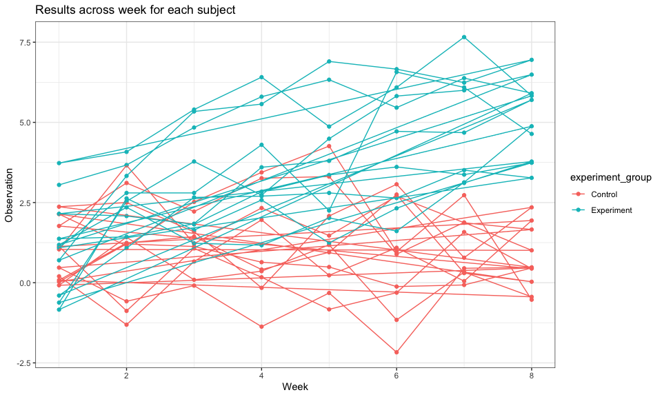
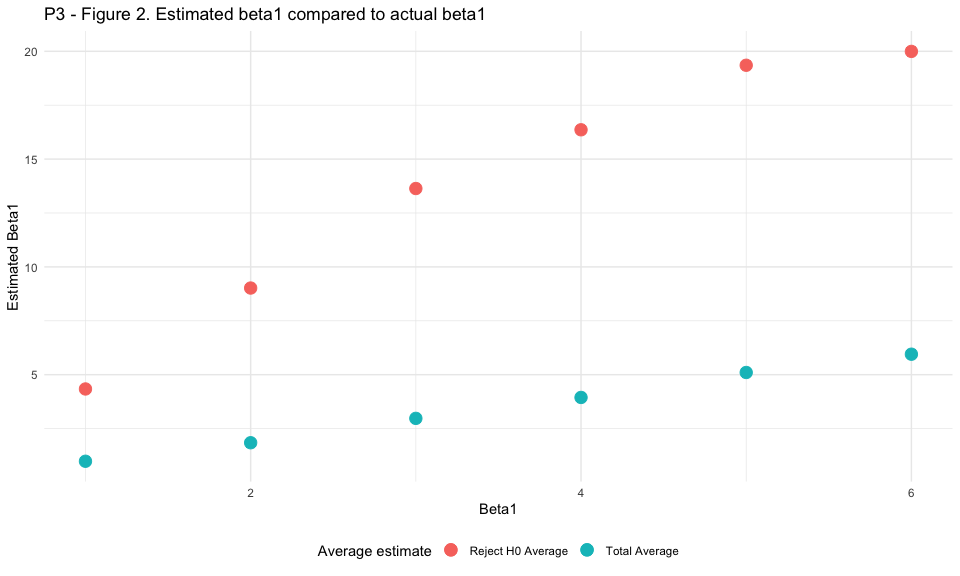

p8105\_HW5\_ah3108
================
Ava Hamilton
11/4/2019

# Problem 1

create a function that takes in a vector, replaces missing values,and
returns the vector.

``` r
set.seed(10)

iris_with_missing = iris %>% 
  map_df(~replace(.x, sample(1:150, 20), NA)) %>%
  mutate(Species = as.character(Species))

col1 = iris_with_missing[1]


fill_NA = function(vec_to_fill) {
  if (is.character(vec_to_fill)) {
    vec_to_fill[is.na(vec_to_fill)] = "virginica"
  } else if (is.numeric(vec_to_fill)) {
    mean_col_val = mean(vec_to_fill,na.rm = T)
    vec_to_fill[is.na(vec_to_fill)] = mean_col_val
  }
  else {
    stop("x is not a numeric or character vector")
  }
  return(vec_to_fill)
}
```

Use a mapping statement to replace missing values in the iris dataset.

``` r
map(iris_with_missing, fill_NA)
```

    ## $Sepal.Length
    ##   [1] 5.100000 4.900000 4.700000 4.600000 5.000000 5.400000 5.819231
    ##   [8] 5.000000 4.400000 4.900000 5.400000 4.800000 5.819231 4.300000
    ##  [15] 5.819231 5.700000 5.400000 5.100000 5.700000 5.100000 5.400000
    ##  [22] 5.100000 4.600000 5.819231 4.800000 5.000000 5.000000 5.200000
    ##  [29] 5.819231 4.700000 4.800000 5.400000 5.200000 5.500000 4.900000
    ##  [36] 5.000000 5.500000 4.900000 4.400000 5.100000 5.000000 4.500000
    ##  [43] 4.400000 5.000000 5.100000 4.800000 5.100000 4.600000 5.300000
    ##  [50] 5.000000 7.000000 6.400000 6.900000 5.500000 6.500000 5.700000
    ##  [57] 6.300000 4.900000 6.600000 5.200000 5.000000 5.900000 6.000000
    ##  [64] 6.100000 5.600000 6.700000 5.600000 5.800000 6.200000 5.600000
    ##  [71] 5.900000 5.819231 6.300000 5.819231 6.400000 6.600000 6.800000
    ##  [78] 6.700000 6.000000 5.700000 5.500000 5.819231 5.800000 6.000000
    ##  [85] 5.400000 5.819231 6.700000 5.819231 5.600000 5.500000 5.500000
    ##  [92] 5.819231 5.800000 5.000000 5.819231 5.700000 5.700000 6.200000
    ##  [99] 5.100000 5.700000 6.300000 5.800000 7.100000 6.300000 6.500000
    ## [106] 7.600000 4.900000 7.300000 6.700000 5.819231 6.500000 5.819231
    ## [113] 6.800000 5.700000 5.800000 6.400000 6.500000 7.700000 7.700000
    ## [120] 6.000000 5.819231 5.600000 7.700000 6.300000 6.700000 7.200000
    ## [127] 6.200000 6.100000 6.400000 7.200000 7.400000 7.900000 6.400000
    ## [134] 5.819231 6.100000 5.819231 5.819231 6.400000 6.000000 6.900000
    ## [141] 6.700000 6.900000 5.819231 6.800000 6.700000 6.700000 6.300000
    ## [148] 6.500000 5.819231 5.900000
    ## 
    ## $Sepal.Width
    ##   [1] 3.500000 3.000000 3.200000 3.100000 3.600000 3.900000 3.400000
    ##   [8] 3.400000 2.900000 3.100000 3.075385 3.400000 3.075385 3.000000
    ##  [15] 4.000000 4.400000 3.900000 3.500000 3.800000 3.800000 3.400000
    ##  [22] 3.700000 3.600000 3.300000 3.400000 3.000000 3.400000 3.500000
    ##  [29] 3.400000 3.200000 3.100000 3.075385 3.075385 4.200000 3.100000
    ##  [36] 3.200000 3.500000 3.600000 3.000000 3.400000 3.500000 3.075385
    ##  [43] 3.200000 3.500000 3.800000 3.000000 3.800000 3.200000 3.700000
    ##  [50] 3.075385 3.075385 3.200000 3.100000 2.300000 2.800000 2.800000
    ##  [57] 3.300000 2.400000 2.900000 2.700000 2.000000 3.000000 2.200000
    ##  [64] 2.900000 2.900000 3.100000 3.000000 3.075385 2.200000 2.500000
    ##  [71] 3.200000 2.800000 2.500000 2.800000 2.900000 3.000000 2.800000
    ##  [78] 3.075385 3.075385 2.600000 2.400000 2.400000 2.700000 2.700000
    ##  [85] 3.000000 3.400000 3.100000 3.075385 3.000000 2.500000 3.075385
    ##  [92] 3.075385 3.075385 2.300000 2.700000 3.000000 2.900000 2.900000
    ##  [99] 2.500000 2.800000 3.075385 2.700000 3.000000 2.900000 3.075385
    ## [106] 3.000000 2.500000 2.900000 3.075385 3.600000 3.200000 2.700000
    ## [113] 3.000000 3.075385 2.800000 3.200000 3.000000 3.800000 2.600000
    ## [120] 2.200000 3.200000 3.075385 2.800000 2.700000 3.300000 3.200000
    ## [127] 2.800000 3.000000 2.800000 3.000000 2.800000 3.800000 2.800000
    ## [134] 2.800000 3.075385 3.000000 3.400000 3.100000 3.000000 3.100000
    ## [141] 3.100000 3.100000 2.700000 3.200000 3.300000 3.000000 2.500000
    ## [148] 3.000000 3.400000 3.000000
    ## 
    ## $Petal.Length
    ##   [1] 1.400000 1.400000 1.300000 1.500000 1.400000 1.700000 1.400000
    ##   [8] 1.500000 1.400000 3.765385 1.500000 1.600000 1.400000 3.765385
    ##  [15] 3.765385 1.500000 1.300000 1.400000 1.700000 1.500000 1.700000
    ##  [22] 1.500000 1.000000 3.765385 1.900000 3.765385 1.600000 1.500000
    ##  [29] 1.400000 1.600000 3.765385 1.500000 1.500000 1.400000 3.765385
    ##  [36] 1.200000 1.300000 1.400000 1.300000 1.500000 1.300000 1.300000
    ##  [43] 1.300000 1.600000 1.900000 1.400000 1.600000 3.765385 1.500000
    ##  [50] 1.400000 4.700000 4.500000 4.900000 4.000000 4.600000 4.500000
    ##  [57] 4.700000 3.765385 4.600000 3.900000 3.765385 4.200000 4.000000
    ##  [64] 4.700000 3.600000 4.400000 4.500000 4.100000 4.500000 3.900000
    ##  [71] 4.800000 4.000000 4.900000 3.765385 4.300000 4.400000 4.800000
    ##  [78] 5.000000 4.500000 3.500000 3.800000 3.700000 3.900000 5.100000
    ##  [85] 4.500000 4.500000 4.700000 4.400000 3.765385 4.000000 4.400000
    ##  [92] 4.600000 4.000000 3.300000 4.200000 4.200000 4.200000 4.300000
    ##  [99] 3.000000 4.100000 3.765385 5.100000 5.900000 5.600000 5.800000
    ## [106] 6.600000 4.500000 6.300000 3.765385 3.765385 5.100000 5.300000
    ## [113] 5.500000 5.000000 5.100000 5.300000 3.765385 6.700000 6.900000
    ## [120] 5.000000 5.700000 4.900000 6.700000 4.900000 5.700000 6.000000
    ## [127] 4.800000 4.900000 5.600000 5.800000 6.100000 3.765385 3.765385
    ## [134] 5.100000 5.600000 6.100000 5.600000 5.500000 4.800000 5.400000
    ## [141] 5.600000 5.100000 5.100000 3.765385 3.765385 5.200000 5.000000
    ## [148] 5.200000 5.400000 5.100000
    ## 
    ## $Petal.Width
    ##   [1] 0.200000 0.200000 0.200000 1.192308 0.200000 0.400000 0.300000
    ##   [8] 0.200000 0.200000 0.100000 0.200000 0.200000 0.100000 0.100000
    ##  [15] 0.200000 0.400000 0.400000 1.192308 0.300000 1.192308 0.200000
    ##  [22] 0.400000 0.200000 0.500000 0.200000 0.200000 0.400000 0.200000
    ##  [29] 0.200000 0.200000 0.200000 0.400000 0.100000 0.200000 0.200000
    ##  [36] 0.200000 0.200000 0.100000 1.192308 0.200000 0.300000 1.192308
    ##  [43] 0.200000 0.600000 0.400000 0.300000 0.200000 0.200000 0.200000
    ##  [50] 0.200000 1.400000 1.500000 1.500000 1.300000 1.500000 1.300000
    ##  [57] 1.600000 1.000000 1.300000 1.400000 1.000000 1.500000 1.192308
    ##  [64] 1.400000 1.300000 1.400000 1.500000 1.000000 1.500000 1.100000
    ##  [71] 1.800000 1.300000 1.500000 1.200000 1.300000 1.400000 1.400000
    ##  [78] 1.192308 1.192308 1.000000 1.100000 1.000000 1.200000 1.600000
    ##  [85] 1.500000 1.600000 1.192308 1.300000 1.192308 1.192308 1.200000
    ##  [92] 1.192308 1.192308 1.192308 1.300000 1.200000 1.300000 1.300000
    ##  [99] 1.192308 1.300000 2.500000 1.900000 2.100000 1.800000 2.200000
    ## [106] 2.100000 1.700000 1.800000 1.800000 2.500000 2.000000 1.900000
    ## [113] 2.100000 2.000000 2.400000 2.300000 1.800000 1.192308 2.300000
    ## [120] 1.500000 1.192308 2.000000 2.000000 1.800000 2.100000 1.800000
    ## [127] 1.800000 1.800000 2.100000 1.600000 1.192308 2.000000 2.200000
    ## [134] 1.500000 1.400000 2.300000 1.192308 1.192308 1.800000 2.100000
    ## [141] 2.400000 2.300000 1.900000 2.300000 2.500000 2.300000 1.900000
    ## [148] 2.000000 2.300000 1.800000
    ## 
    ## $Species
    ##   [1] "setosa"     "setosa"     "setosa"     "setosa"     "setosa"    
    ##   [6] "setosa"     "setosa"     "setosa"     "setosa"     "setosa"    
    ##  [11] "setosa"     "setosa"     "setosa"     "setosa"     "setosa"    
    ##  [16] "setosa"     "setosa"     "setosa"     "setosa"     "setosa"    
    ##  [21] "setosa"     "virginica"  "setosa"     "setosa"     "virginica" 
    ##  [26] "setosa"     "virginica"  "setosa"     "setosa"     "setosa"    
    ##  [31] "setosa"     "setosa"     "setosa"     "setosa"     "setosa"    
    ##  [36] "setosa"     "setosa"     "setosa"     "setosa"     "setosa"    
    ##  [41] "setosa"     "virginica"  "setosa"     "setosa"     "setosa"    
    ##  [46] "virginica"  "setosa"     "setosa"     "setosa"     "setosa"    
    ##  [51] "virginica"  "versicolor" "versicolor" "versicolor" "versicolor"
    ##  [56] "versicolor" "virginica"  "versicolor" "virginica"  "versicolor"
    ##  [61] "versicolor" "versicolor" "versicolor" "versicolor" "versicolor"
    ##  [66] "versicolor" "versicolor" "versicolor" "versicolor" "versicolor"
    ##  [71] "versicolor" "virginica"  "versicolor" "versicolor" "versicolor"
    ##  [76] "versicolor" "versicolor" "versicolor" "versicolor" "virginica" 
    ##  [81] "versicolor" "versicolor" "versicolor" "versicolor" "versicolor"
    ##  [86] "versicolor" "versicolor" "versicolor" "versicolor" "versicolor"
    ##  [91] "versicolor" "versicolor" "versicolor" "virginica"  "versicolor"
    ##  [96] "versicolor" "versicolor" "versicolor" "versicolor" "virginica" 
    ## [101] "virginica"  "virginica"  "virginica"  "virginica"  "virginica" 
    ## [106] "virginica"  "virginica"  "virginica"  "virginica"  "virginica" 
    ## [111] "virginica"  "virginica"  "virginica"  "virginica"  "virginica" 
    ## [116] "virginica"  "virginica"  "virginica"  "virginica"  "virginica" 
    ## [121] "virginica"  "virginica"  "virginica"  "virginica"  "virginica" 
    ## [126] "virginica"  "virginica"  "virginica"  "virginica"  "virginica" 
    ## [131] "virginica"  "virginica"  "virginica"  "virginica"  "virginica" 
    ## [136] "virginica"  "virginica"  "virginica"  "virginica"  "virginica" 
    ## [141] "virginica"  "virginica"  "virginica"  "virginica"  "virginica" 
    ## [146] "virginica"  "virginica"  "virginica"  "virginica"  "virginica"

# Problem 2

``` r
df_p2 = tibble(in_file = list.files(path = "./datafiles/")) 

df_p2 = df_p2 %>% 
  mutate(
    map(in_file, ~ read_csv(file.path(path = "./datafiles/", .)))
  ) %>% 
  unnest()

df_p2 = df_p2 %>% 
  separate(col = in_file, into = c("experiment_group", "subject")) %>%
  mutate(
    subject = as.numeric(subject),
    experiment_group = as.factor(experiment_group),
    experiment_group = factor(experiment_group, levels = c("con", "exp"), labels = c("Control", "Experiment")),
    subject = case_when(
      experiment_group == "Experiment" ~ subject+10,
      experiment_group == "Control" ~ subject
    ),
    grouptest = as.character(experiment_group)
  ) 


long_df_p2 = df_p2 %>% 
  pivot_longer(
    week_1:week_8,
    names_to = "week",
    names_prefix = "week_",
    values_to = "data_point"
  ) %>% 
  mutate(
    week = as.numeric(week)
  ) %>% 
  group_by(subject)


long_df_p2 %>% 
  ggplot(aes(x = week, y = data_point, color = experiment_group)) +
  geom_point() +
  geom_path() +
  theme_bw() +
  labs(
    title = "Results across week for each subject",
    x = "Week",
    y = "Observation")
```

<!-- -->

The Control group had relatively stable observations over the 8 weeks
starting with a mean of (mean = 0.915). The obersvations for subjects in
the Experiment group increased across time starting with a mean of (mean
= 1.141). By the 6th week almost all subjects in the experiment group
had higher observations (mean = 4.55) than those in the control group
(mean = 0.771). By the end of the study period, in the 8th week, all
subjects in the experiment group (mean = 5.119) had higher values than
the control group (mean = 0.74).

# Problem 3

``` r
# function to simulate data wtih n = 30, beta0 = 2


sim_data_fxn = function(beta1) {
  n = 30
  beta0 = 2
  # table of simulated data
  sim_data = tibble(
    x = rnorm(n, mean = 0, sd = 1),
    y = beta0 + beta1 * x + rnorm(n, 0, 50)
  )
  # run linear model and clean output
  ls_fit = lm(y ~ x, data = sim_data) %>% 
    broom::tidy() %>% 
    filter(term == "x") %>% 
    select(estimate, p.value)
}


#### large 
sim_results_large =
  tibble(beta1 = c(1, 2, 3, 4, 5, 6)) %>% 
  mutate(
    output_list = map(.x = beta1, ~rerun(10000, sim_data_fxn(beta1 = .x))),
    output_df = map(output_list, bind_rows)
  ) %>% 
  select(-output_list) %>% 
  unnest(output_df)


sim_results_large_edit = sim_results_large %>% 
  mutate(
    reject_H0 = case_when(
      p.value < 0.05 ~ 1,
      p.value >=0.05 ~ 0
    )
  )

sim_results_large_edit = sim_results_large_edit %>% 
  group_by(beta1) %>% 
  mutate(
    sum_reject_HO = sum(reject_H0),
    prop_reject_H0 = sum_reject_HO/length(sum_reject_HO)
    
  ) %>% 
  ungroup()

prob3_plot1 = sim_results_large_edit %>%
  distinct(beta1, prop_reject_H0, sum_reject_HO) %>% 
  mutate(
    perc_rej_H0 = prop_reject_H0 * 100
  )


prob3_plot1 %>% 
  ggplot(aes(x = beta1, y = perc_rej_H0, fill = beta1)) + 
  geom_bar(stat = "identity") +
  labs(
    title = "P3 - Figure 1. Reject H0 based on beta 1",
    x = "Beta 1",
    y = "% Reject HO")
```

<!-- -->

``` r
prob3_plot2a = sim_results_large_edit %>% 
  group_by(beta1) %>% 
  mutate(
    avg_beta1 = mean(estimate)
  ) %>% 
  ungroup() %>% 
  distinct(beta1, avg_beta1)

prob3_plot2b = sim_results_large_edit %>% 
  filter(reject_H0 == 1) %>% 
  group_by(beta1) %>% 
  mutate(
    avg_beta1 = mean(estimate)
  ) %>% 
  ungroup() %>% 
  distinct(beta1, avg_beta1)

prob3_plot2a %>% 
  ggplot(aes(x = beta1, y = avg_beta1, color = "Total Average")) +
  geom_point(size = 4) +
  geom_point(data = prob3_plot2b, size = 4, aes(color = "Reject H0 Average")) +
  labs(
    title = "P3 - Figure 2. Estimated beta1 compared to actual beta1",
    x = "Beta1",
    y = "Estimated Beta1",
    color = "Average estimate")
```

<!-- -->

The average estimates of beta1 when the null hypothesis was rejected are
not close to the actal values of beta1. This is because the null
hypothesis is testing whether the slope of the simulated data is
significantly different from beta1. If the slope of the data **is**
signficantly different than beta1, then the null hyptoehsis is rejected.
Therefore, the average estimates of beta among the samples for which the
null was rejected, are not approximately equal to the actual estimates.
